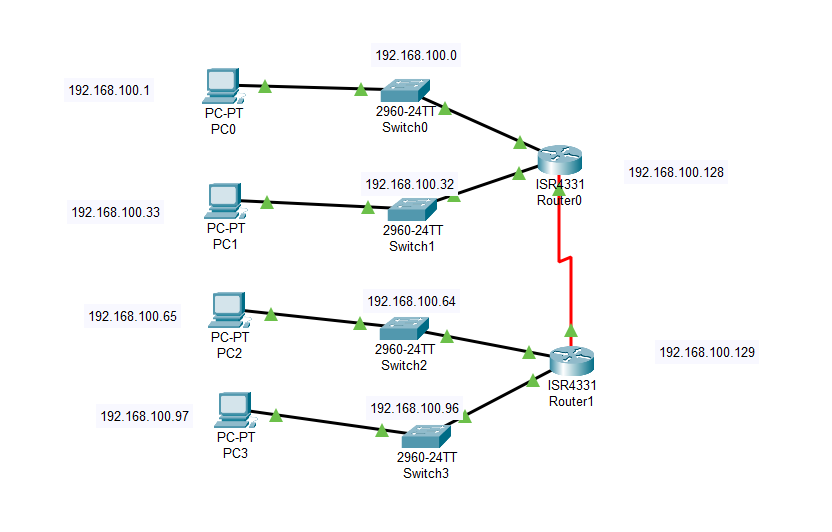
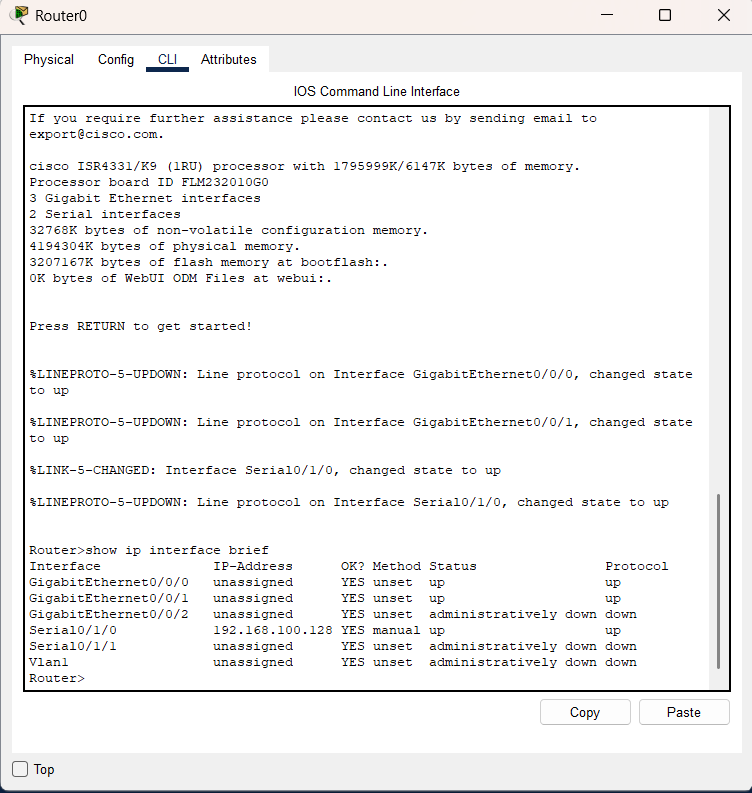
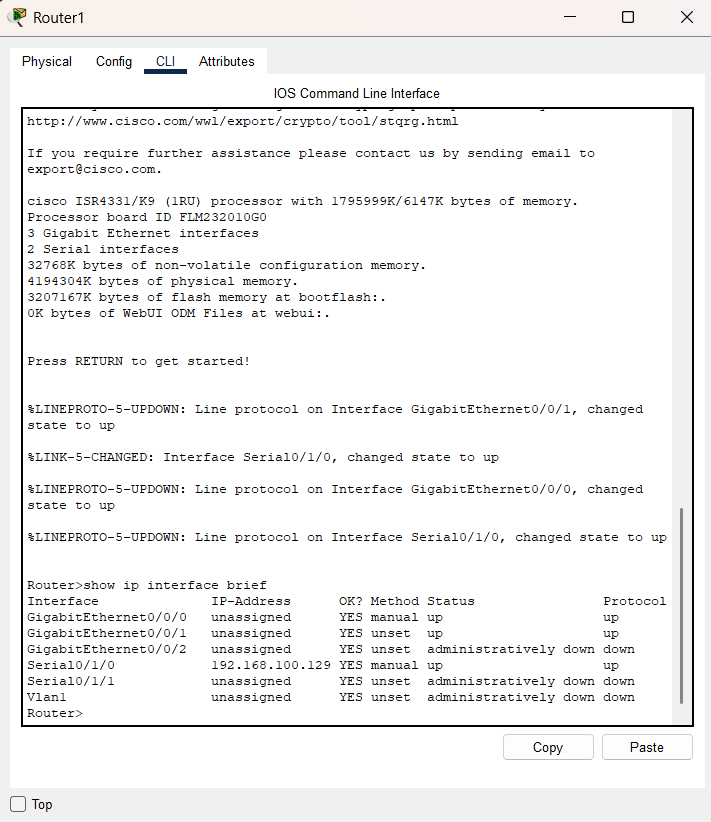

# IP Subnetting & Router Configuration Simulation 🌐

This project demonstrates subnet planning and router interface configuration using Cisco Packet Tracer. A `/24` network is logically divided into multiple subnets to support 4 LAN segments and 1 WAN link, ensuring organized IP distribution and communication readiness.

**Course:** Computer Networks (4th Semester)  
**Tool Used:** Cisco Packet Tracer  
**Focus:** IPv4 subnetting, address planning, router interface configuration

---

## 🔧 Tools & Technologies

- Cisco Packet Tracer  
- IPv4 Addressing & CIDR-based Subnetting  
- Router CLI Configuration  
- Binary subnetting & logical planning  

---

## 📂 Project Files

- `IP-Subnetting-Simulation.pkt` – Main simulation file (open in Cisco Packet Tracer)  
- `/assets/screenshots/` – Visual outputs including network layout and router configurations  
- `/report/Subnetting-Report.pdf` – Full written report with subnet tables, IP assignments, and explanation

---

## 🧪 What’s Demonstrated

### ✅ Subnetting Logic
- Divided `192.168.100.0/24` into:
  - 4 LAN subnets using `/27`
  - 1 WAN subnet using `/30`
- Ensured usable host count matches device requirements

### 🖧 Router Interface Configuration
- Assigned first usable IP to routers  
- Activated interfaces using `no shutdown`  
- Logical IP assignment for switches and PCs

---

## 📘 Key Learning

- How to plan subnets using binary and CIDR notation  
- Assigning IPs systematically across routers, switches, and hosts  
- Structuring a simulation project with real-world addressing logic  
- Verifying IP distribution and interface states using router CLI  

---

## 🧠 How Subnetting Works (Short Answer)

Subnetting splits a larger IP block into smaller, manageable segments. A router determines whether a destination IP is part of a known subnet by applying a bitwise AND between the destination IP and subnet mask. If the result matches a known network address in its routing table, the router forwards the packet to the correct interface; otherwise, it looks for alternative routes.

---

## 📸 Screenshots

<p float="left">
  
  
  
</p>

---

## 📥 How to Run

1. **Clone the repository:**
   ```bash
   git clone https://github.com/Sameed-333/ip-subnetting-routing-simulation.git
2. **Navigate to the project folder:**
    ```bash
    cd ip-subnetting-routing-simulation
3. **Open the simulation file:**
    Launch IP-Subnetting-Simulation.pkt using Cisco Packet Tracer.
4. **Explore the simulation:**
    - View the full network topology and cabling.
    - Open the CLI on Router0 and Router1 and run:
         ```bash
         show ip interface brief
         show running-config
    - Assign or verify IPs on PCs and switches.
    - Use ping between devices to test reachability.
5.  **Review the Report:**
    - Open the report file at:
      **[Subnetting-Report](Report/Subnetting-Report.pdf)**

---

## ⚠️ Disclaimer

This project was created for educational purposes as part of a Computer Networks course. It is a simulation of subnetting design and router configuration using Cisco Packet Tracer.
